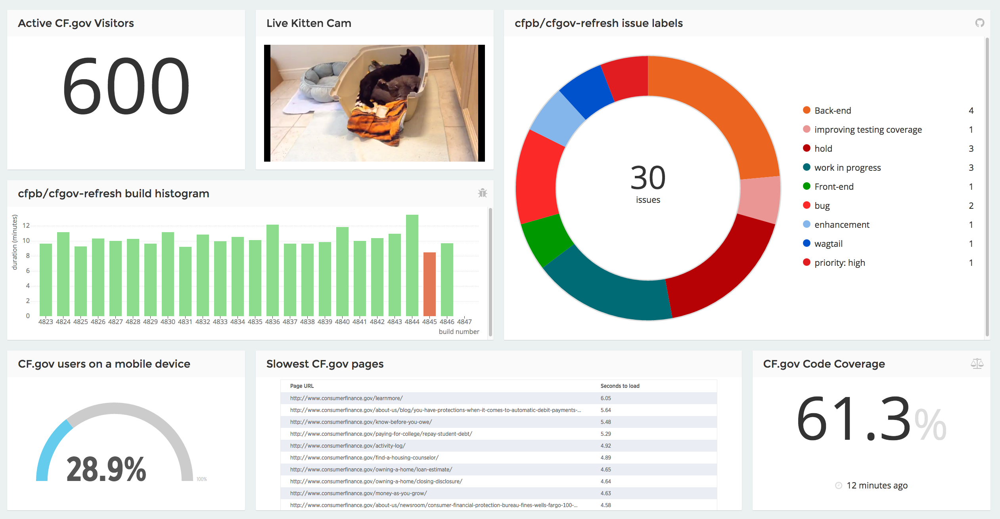

# Consumerfinance.gov status dashboard



To keep track of important stuff. Powered by [Mozaïk](http://mozaik.rocks).

## Installation

```bash
git clone git@github.com:cfpb/dashboard.git
cd dashboard
cp .env.sample .env # Get our .env file at [GHE]/cfpb/.env (and change PORT in that file)
npm install
npm start
```

----

## Open source licensing info
1. [TERMS](TERMS.md)
2. [LICENSE](LICENSE)
3. [CFPB Source Code Policy](https://github.com/cfpb/source-code-policy/)
